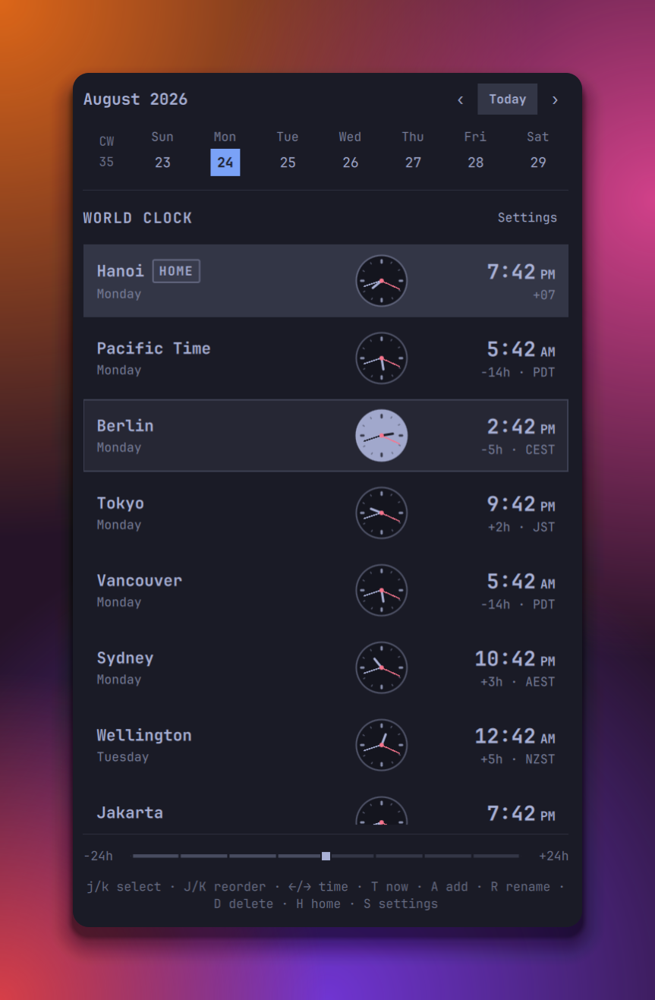

# Omarchy World Clock

A keyboard-friendly world clock for the Omarchy Quattro bar. Track multiple
locations, plan with the time slider, and compare local times using digital
or analog clocks.

It works alongside the built-in `omarchy.clock`; it does not replace it.



## Features

- [x] Multiple named IANA timezones with one clearly marked Home location
- [x] Smart three-region defaults based on the machine's local timezone
- [x] DST-correct time conversion and local calendar dates
- [x] Fixed calendar header and fixed ±24-hour slider around a scrollable clock list
- [x] Responsive 15-minute slider steps with keyboard and mouse control
- [x] 12- and 24-hour digital time with clear AM/PM in 12-hour mode
- [x] Optional analog faces with day/night styling and a live red seconds hand
- [x] Add, rename, remove, reorder, and set Home without a separate manage mode
- [x] Keyboard navigation for clocks, settings, and all clock-management actions
- [x] Drag-and-drop clock reordering with animated row movement
- [x] Local timezone search using the installed system timezone database
- [x] Plugin-owned configuration in the World Clock entry of `shell.json`

## Requirements

- Omarchy 4 / Quattro
- Python 3.9 or newer with `zoneinfo`
- Installed system timezone data (`tzdata` on Arch Linux)

The plugin runs `helpers/timezone.py` locally with fixed argument arrays. It
does not use the network, install a system service, request privileges, or
invoke a shell.

## Install

```sh
omarchy plugin add https://github.com/ptgamr/oma-world-clock.git --enable
```

The widget defaults to the right bar section, leaving the normal Omarchy clock
available in the center. Move it at any time with:

```sh
omarchy bar move io.github.ptgamr.world-clock --section right
```

## Remove

```sh
omarchy plugin remove io.github.ptgamr.world-clock
```

World Clock reads and writes only its own plugin entry. It does not modify
settings or files belonging to `omarchy.clock`.

## First run

On first run, World Clock detects the machine's IANA timezone, places it first
as Home, and adds two representative clocks from other regions:

- Asia home: Berlin and New York
- Europe home: Ho Chi Minh City and New York
- Americas home: Berlin and Ho Chi Minh City
- Africa home: Berlin and Ho Chi Minh City
- Oceania home: Ho Chi Minh City and New York
- UTC or an unclassified timezone: Berlin and Ho Chi Minh City

The detected clocks are saved as normal configuration. Detection runs only
once and never replaces locations the user has already configured.

## Use

Only the clock list scrolls. The calendar and World Clock header remain fixed
at the top, while the time slider and keyboard guide remain fixed at the
bottom. Moving away from Now replaces the guide with the selected Home date,
time, and offset, plus a muted `T now` reminder.

| Key | Action |
| --- | --- |
| `j` / `k` or Down / Up | Select the next or previous clock |
| Home / End | Select the first or last clock |
| Shift+`j` / Shift+`k` | Move the selected clock down or up |
| Left / Right | Move all clocks by 15 minutes |
| Shift+Left / Shift+Right | Move all clocks by one hour |
| `T` | Return to the current time |
| `[` / `]` | Move the calendar by one day |
| Shift+`[` / Shift+`]` | Move the calendar by one week |
| `A` | Add a timezone |
| `R` | Rename the selected clock |
| `D` or Delete | Remove the selected clock |
| `H` | Make the selected clock Home |
| `S` | Open Settings |
| Escape | Close the current form, Settings, or the panel |

Clock rows can also be dragged to reorder them. Drag or scroll the slider to
move continuously in 15-minute steps, and right-click it to return to Now.

In Settings, use `j` / `k` to choose an option, Left / Right to change it,
and Enter or Space to apply it. `A` toggles analog clocks; `1` and `2`
select the 12- and 24-hour formats directly.

## Configuration

Locations and appearance settings are stored in this widget's entry in
`~/.config/omarchy/shell.json`:

```json
{
  "id": "io.github.ptgamr.world-clock",
  "configVersion": 1,
  "showAnalogClock": true,
  "hourFormat": "12",
  "locations": [
    {
      "id": "home",
      "name": "Ho Chi Minh City",
      "timezone": "Asia/Ho_Chi_Minh",
      "isHome": true,
      "latitude": 10.8231,
      "longitude": 106.6297
    },
    {
      "id": "berlin",
      "name": "Berlin",
      "timezone": "Europe/Berlin",
      "isHome": false,
      "latitude": 52.52,
      "longitude": 13.405
    },
    {
      "id": "new-york",
      "name": "New York",
      "timezone": "America/New_York",
      "isHome": false,
      "latitude": 40.7128,
      "longitude": -74.006
    }
  ]
}
```

## Roadmap

- [x] Compact world-clock panel
- [x] Smart first-run defaults across three regions
- [x] Keyboard-first clock management and Settings
- [x] Fixed calendar, scrollable clocks, and fixed time controls
- [ ] Meeting planner full view
  - [x] Resizable shared-state window prototype
  - [x] Horizontal 24-hour timezone timeline prototype
  - [x] Meeting-time selection and copy action prototype
  - [x] World map, city markers, and timezone-boundary prototype
  - [ ] Finish the full-view UX and expose it from the compact release UI

The full-view implementation remains in the repository for development, but
it is intentionally hidden from the compact release UI until the remaining
polish and accessibility work is complete.

## Validate

```sh
omarchy plugin validate .
qmllint -I /usr/share/omarchy/shell BarWidget.qml Panel.qml FullView.qml components/*.qml
python3 -m unittest discover -s tests -p 'test_*.py'
node tests/model-test.js
node tests/timezone-lookup-test.js
```

## Data and license

World Clock is released under the [MIT License](LICENSE).

The coastline asset comes from public-domain Natural Earth data. The compact
timezone lookup is derived from timezone-boundary-builder release 2026c under
the Open Database License 1.0. Source, checksums, attribution, and regeneration
details are documented in
[`assets/TIMEZONE_BOUNDARIES.md`](assets/TIMEZONE_BOUNDARIES.md) and
[`assets/NATURAL_EARTH.md`](assets/NATURAL_EARTH.md).
