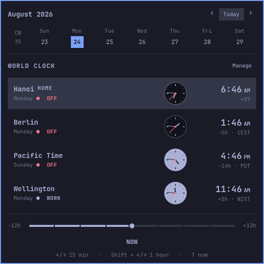
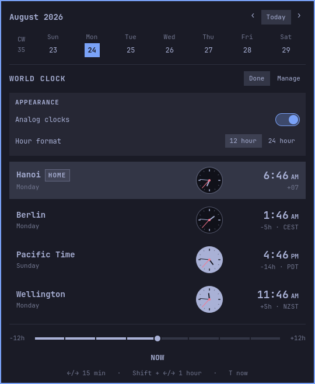
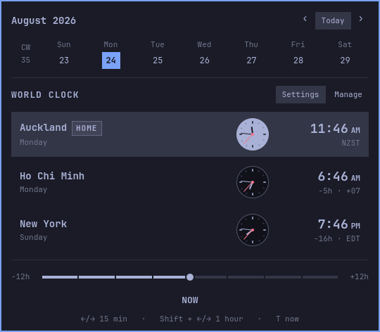
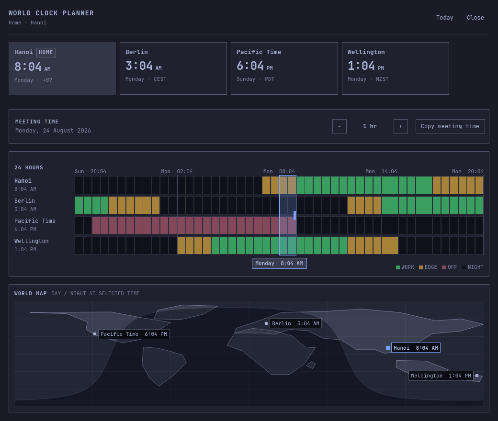
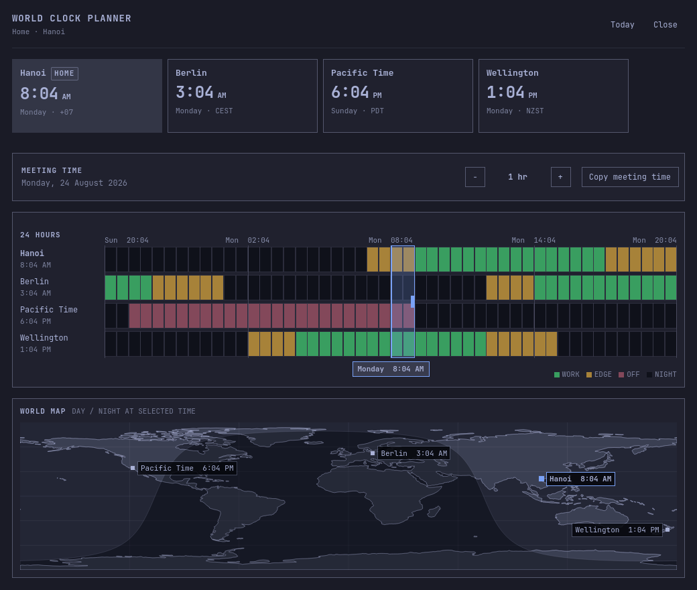
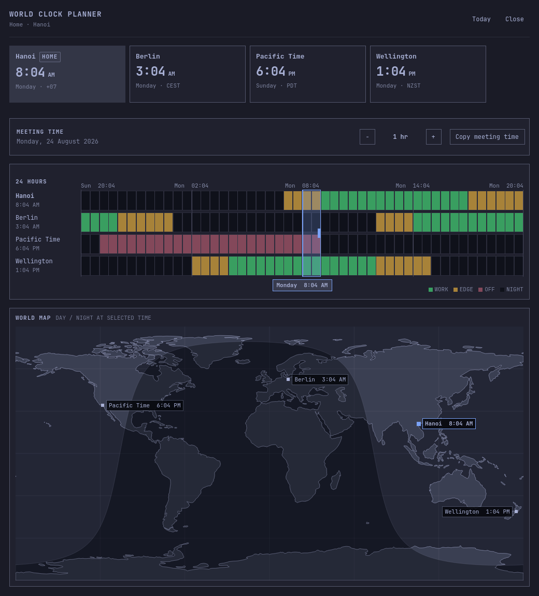
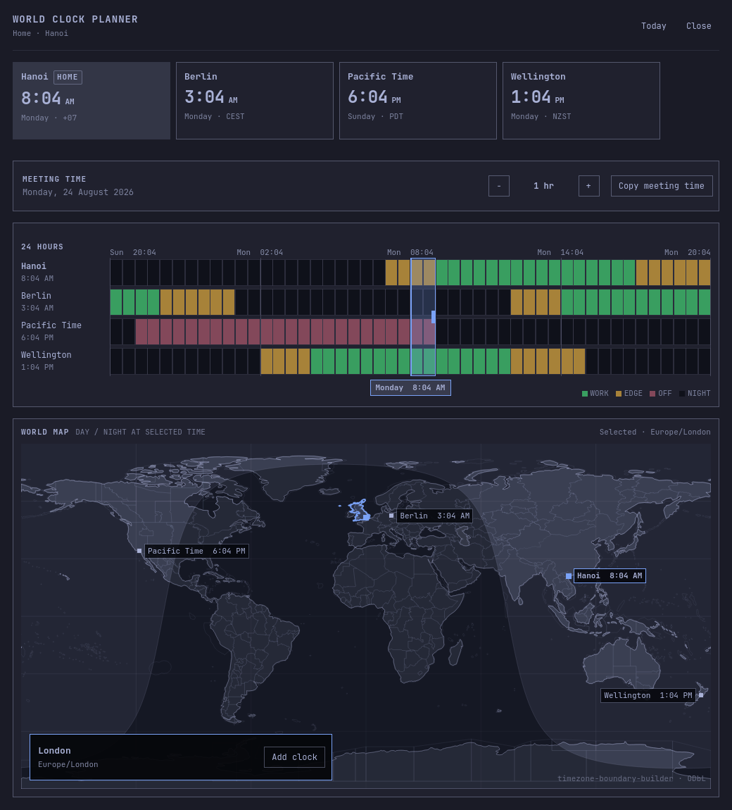

# Omarchy World Clock

A standalone world-clock and meeting-planner plugin for the Omarchy Quattro bar. It is designed to live beside the built-in `omarchy.clock`, not replace it.

## UI evolution

| v1 — clocks first | v2 — calendar first |
| --- | --- |
| [](screenshots/world-clock-panel-v1.png) | [](screenshots/world-clock-panel-v2.png) |
| v3 — compact | v4 — analog day/night |
| [](screenshots/world-clock-panel-v3.png) | [](screenshots/world-clock-panel-v4.png) |

**v5 — aligned analog faces with seconds hand**

[](screenshots/world-clock-panel-v5.png)

**v6 — weekday and timezone columns**

[](screenshots/world-clock-panel-v6.png)

**v7 — simplified rows and appearance settings**

[](screenshots/world-clock-panel-v7.png)

**v8 — square appearance switch**

[](screenshots/world-clock-panel-v8.png)

**v9 — timezone-aware three-clock first run**

[](screenshots/world-clock-panel-v9.png)

**v10 — expanded meeting planner**

[](screenshots/world-clock-full-v10.png)

**v11 — real coastlines and precise city markers**

[](screenshots/world-clock-full-v11.png)

**v12 — proportionate world map**

[](screenshots/world-clock-full-v12.png)

**v13 — interactive timezone boundaries (current)**

[](screenshots/world-clock-full-v13.png)

New UI captures increment the suffix (`v10`, `v11`, `v12`, `v13`, …) so earlier layouts remain available for comparison.

Version 0.1 includes:

- multiple named IANA timezones with one home location
- three-continent first-run defaults based on the machine's local timezone
- DST-correct conversion for the selected instant
- a ±12 hour planner with 15-minute snapping
- local-calendar date navigation that remains correct across DST changes
- aligned analog faces with light/day, dark/night dials and a live red seconds hand
- full local weekdays and aligned timezone details beneath each digital clock
- appearance settings for analog visibility and 12/24-hour time
- add, remove, rename, reorder, and set-home controls
- timezone search backed by the installed system timezone database
- a separate resizable planner window sharing the compact panel's clocks and selected instant
- a DST-correct horizontal 24-hour timeline with a selectable meeting range
- 15-minute meeting-duration controls and a `Copy meeting time` action
- a bundled Natural Earth world map with precise city markers and selected-time day/night shading
- interactive geographic timezone boundaries with hover, selection, and add-clock actions
- configuration persistence in this plugin's own `shell.json` bar entry

## Requirements

- Omarchy 4 / Quattro
- Python 3.9 or newer with `zoneinfo`
- installed system timezone data (`tzdata` on Arch Linux)

The plugin runs `helpers/timezone.py` locally with fixed argument arrays. It does not use the network, start a service, request privileges, or execute a shell.

The coastline asset comes from public-domain Natural Earth data. The compact
timezone lookup is derived from timezone-boundary-builder release 2026c and is
available under the Open Database License 1.0; source, checksum, attribution,
and regeneration details are in [`assets/TIMEZONE_BOUNDARIES.md`](assets/TIMEZONE_BOUNDARIES.md).

## Install

After publishing the repository:

```sh
omarchy plugin add https://github.com/ptgamr/oma-world-clock.git --enable
```

The manifest defaults to the right section so the normal Omarchy clock can remain in the center. Move it at any time with:

```sh
omarchy bar move io.github.ptgamr.world-clock --section right
```

## Use

Click the world-clock icon in the bar to open the planner. On first run the
plugin detects the machine's IANA timezone, puts it first as `HOME`, and adds
two representative clocks from other regions:

- Asia home: Berlin and New York
- Europe home: Ho Chi Minh and New York
- Americas home: Berlin and Ho Chi Minh
- Africa home: Berlin and Ho Chi Minh
- Oceania home: Ho Chi Minh and New York
- UTC or an unclassified timezone: Berlin and Ho Chi Minh

This produces three clocks in three different regions. The result is saved as
normal location configuration, so detection runs only once and never replaces
locations the user has already configured.

- Drag or scroll the slider to move all clocks continuously in 15-minute steps.
- Press Left/Right for 15 minutes; hold Shift for one hour.
- Press `T` or click `NOW` to return to the live current instant.
- Press `[` / `]` to move one calendar day; hold Shift to move one week.
- Press `j`/`k` (or Down/Up) to select a clock. The first key press selects
  the first/last row.
- Press `Shift+j` / `Shift+k` to move the selected clock down/up, or drag any
  clock row to reorder it.
- Press `h` to make the selected clock the Home location.
- Press `m` to open Manage. Use `r` or Enter to rename the selected clock,
  `x` or Delete to remove it, and `a` to add a location.
- Press `s` to open Settings. Use `j`/`k` to select a setting, Left/Right to
  change it, and Enter/Space to apply it. `a` toggles analog clocks; `1` and
  `2` select 12- and 24-hour formats directly.
- Press `o` to open the full planner view.
- Press Escape to leave Manage/Settings first; press it again to close the
  panel.
- Click a day in the calendar strip to plan on that home-timezone date.
- Use the calendar arrows to move one week at a time, or click `Today` to return.
- Click `Manage` to rename, reorder, remove, or change the home location.
- Click `Settings` to show or hide analog clocks and choose 12- or 24-hour time.
- To change the home location later, click `Manage`, click `Home` on its row, then click `Done`.
- Click `Add location` and search by a city such as `London` or an IANA ID such as `Europe/London`.
- Click `Open full view` to open the resizable planner window.
- Click or drag across the 24-hour timeline to choose the meeting start.
- Use `−` / `+` to change the meeting duration in 15-minute steps.
- Click `Copy meeting time` to copy every location's local time range.
- The world map follows the same selected instant, plots saved city coordinates, and shades the night side locally.
- Hover a land region to reveal its geographic IANA timezone.
- Click a region to lock the selection, then click `Add clock`; configured zones show `Added` instead.
- Clicking near an existing city marker preserves that clock's chosen timezone and label.

## Validate

```sh
omarchy plugin validate .
qmllint -I /usr/share/omarchy/shell BarWidget.qml Panel.qml FullView.qml components/*.qml
python -m unittest discover -s tests
node tests/model-test.js
node tests/timezone-lookup-test.js
```

For a reviewer screenshot of the loaded panel while the session is unlocked,
ask the running widget to capture only its own QML content:

```sh
omarchy-shell io.github.ptgamr.world-clock capturePreview
# writes /tmp/omarchy-world-clock-preview.png
```

If the widget was just hot-reloaded and its old IPC handler is still retiring,
the equivalent bar-setting trigger is:

```sh
omarchy-shell shell setBarWidget io.github.ptgamr.world-clock _capturePreview true '{}'
# reset the one-shot trigger after the file is written
omarchy-shell shell setBarWidget io.github.ptgamr.world-clock _capturePreview false '{}'
```

A secure compositor lock can prevent the popup surface from mapping. The
checked-in v13 screenshot was therefore rendered offscreen from the real
full-view QML components, current Omarchy theme values, and deterministic
timezone-helper-shaped data.

The expanded view also supports a fixed-path reviewer capture while the
session is unlocked:

```sh
omarchy-shell shell summon io.github.ptgamr.world-clock '{"capturePreview":true}'
# writes /tmp/omarchy-world-clock-full-preview.png
```

## Configuration

Locations are written into this widget's own entry in `~/.config/omarchy/shell.json`:

```json
{
  "id": "io.github.ptgamr.world-clock",
  "configVersion": 1,
  "showAnalogClock": true,
  "hourFormat": "12",
  "locations": [
    {
      "id": "hanoi",
      "name": "Hanoi",
      "timezone": "Asia/Ho_Chi_Minh",
      "isHome": true,
      "latitude": 21.0278,
      "longitude": 105.8342
    },
    {
      "id": "berlin",
      "name": "Berlin",
      "timezone": "Europe/Berlin",
      "isHome": false,
      "latitude": 52.52,
      "longitude": 13.405
    },
    {
      "id": "pacific-time",
      "name": "Pacific Time",
      "timezone": "America/Los_Angeles",
      "isHome": false,
      "latitude": 34.0522,
      "longitude": -118.2437
    },
    {
      "id": "wellington",
      "name": "Wellington",
      "timezone": "Pacific/Auckland",
      "isHome": false,
      "latitude": -41.2866,
      "longitude": 174.7756
    }
  ]
}
```

No settings or files belonging to `omarchy.clock` are read or modified.
