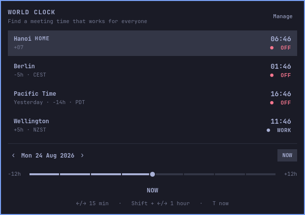
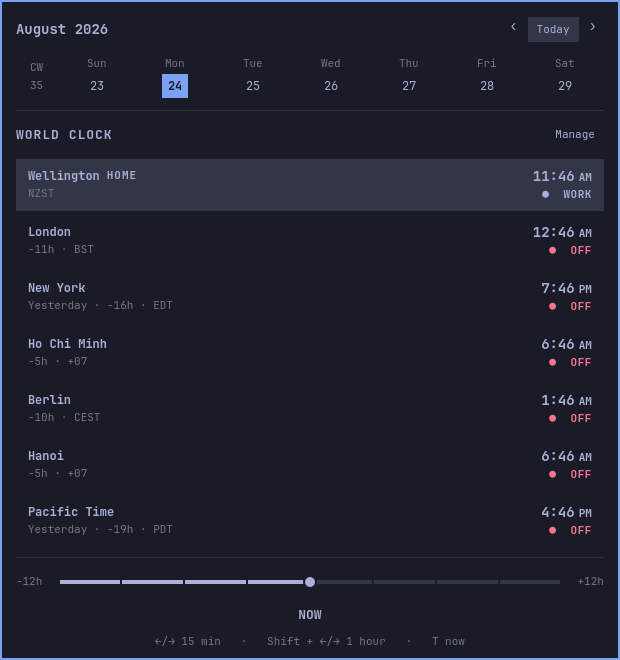
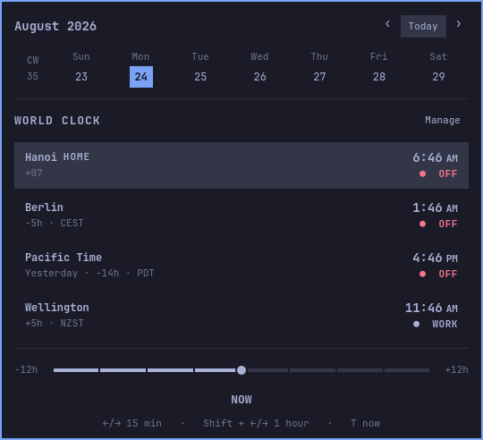
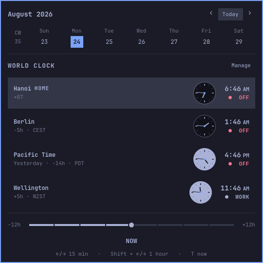
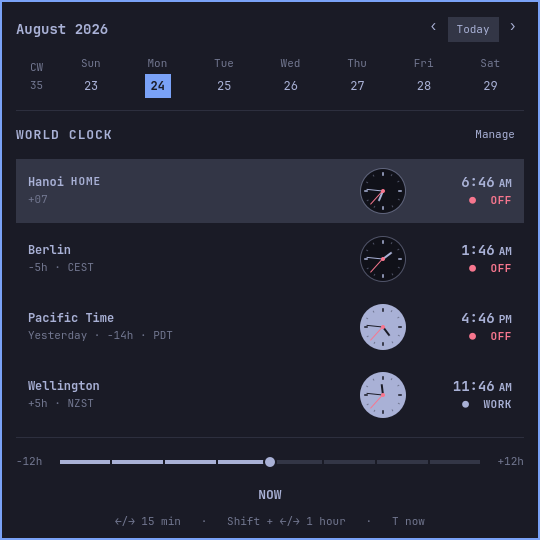

# Omarchy World Clock

A standalone world-clock and meeting-planner plugin for the Omarchy Quattro bar. It is designed to live beside the built-in `omarchy.clock`, not replace it.

## UI evolution

| v1 — clocks first | v2 — calendar first |
| --- | --- |
| [](screenshots/world-clock-panel-v1.png) | [](screenshots/world-clock-panel-v2.png) |
| v3 — compact | v4 — analog day/night |
| [](screenshots/world-clock-panel-v3.png) | [](screenshots/world-clock-panel-v4.png) |

**v5 — aligned analog faces with seconds hand (current)**

[](screenshots/world-clock-panel-v5.png)

New UI captures increment the suffix (`v6`, `v7`, …) so earlier layouts remain available for comparison.

Version 0.1 includes:

- multiple named IANA timezones with one home location
- DST-correct conversion for the selected instant
- a ±12 hour planner with 15-minute snapping
- local-calendar date navigation that remains correct across DST changes
- working-hours, edge-hours, and off-hours indicators
- aligned analog faces with light/day, dark/night dials and a live red seconds hand
- add, remove, rename, reorder, and set-home controls
- timezone search backed by the installed system timezone database
- configuration persistence in this plugin's own `shell.json` bar entry

## Requirements

- Omarchy 4 / Quattro
- Python 3.9 or newer with `zoneinfo`
- installed system timezone data (`tzdata` on Arch Linux)

The plugin runs `helpers/timezone.py` locally with fixed argument arrays. It does not use the network, start a service, request privileges, or execute a shell.

## Install

After publishing the repository:

```sh
omarchy plugin add https://github.com/ptgamr/oma-world-clock.git --enable
```

The manifest defaults to the right section so the normal Omarchy clock can remain in the center. Move it at any time with:

```sh
omarchy bar move io.github.ptgamr.world-clock --section right
```

## Use

Click the world-clock count in the bar to open the planner. The initial set
contains Hanoi, Berlin, Pacific Time, and Wellington in that order. Pacific
Time uses `America/Los_Angeles`, so it follows PST/PDT automatically. Hanoi is
the default home location.

- Drag or scroll the slider to move all clocks in 15-minute steps.
- Press Left/Right for 15 minutes; hold Shift for one hour.
- Press `T` or click `NOW` to return to the live current instant.
- Click a day in the calendar strip to plan on that home-timezone date.
- Use the calendar arrows to move one week at a time, or click `Today` to return.
- Click `Manage` to rename, reorder, remove, or change the home location.
- To change the home location later, click `Manage`, click `Home` on its row, then click `Done`.
- Click `Add location` and search by a city such as `London` or an IANA ID such as `Europe/London`.

Green/theme-accent `WORK` means Monday-Friday 09:00-17:00, `EDGE` means 07:00-09:00 or 17:00-20:00, and `OFF` covers nights and weekends.

## Validate

```sh
omarchy plugin validate .
qmllint -I /usr/share/omarchy/shell BarWidget.qml Panel.qml
python -m unittest discover -s tests
node tests/model-test.js
```

For a reviewer screenshot of the loaded panel while the session is unlocked,
ask the running widget to capture only its own QML content:

```sh
omarchy-shell io.github.ptgamr.world-clock capturePreview
# writes /tmp/omarchy-world-clock-preview.png
```

If the widget was just hot-reloaded and its old IPC handler is still retiring,
the equivalent bar-setting trigger is:

```sh
omarchy-shell shell setBarWidget io.github.ptgamr.world-clock _capturePreview true '{}'
# reset the one-shot trigger after the file is written
omarchy-shell shell setBarWidget io.github.ptgamr.world-clock _capturePreview false '{}'
```

A secure compositor lock can prevent the popup surface from mapping. The
checked-in screenshot was therefore rendered offscreen from the same panel
layout, current Omarchy theme values, and timezone-helper output.

## Configuration

Locations are written into this widget's own entry in `~/.config/omarchy/shell.json`:

```json
{
  "id": "io.github.ptgamr.world-clock",
  "locations": [
    {
      "id": "hanoi",
      "name": "Hanoi",
      "timezone": "Asia/Ho_Chi_Minh",
      "isHome": true
    }
  ]
}
```

No settings or files belonging to `omarchy.clock` are read or modified.
